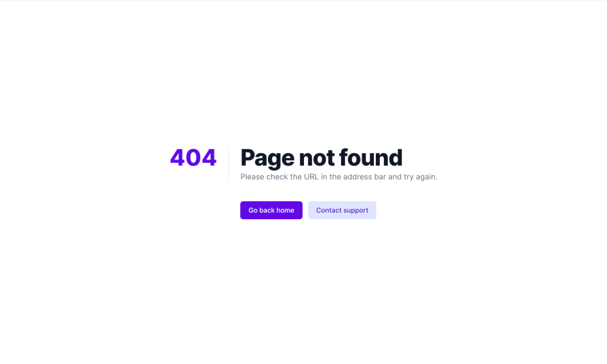

Bishal Koirala
# Assignment-4: Design Navbar, CTA, Hero section and 404 page.
        -As shown in the figure below, design 404 page.   
  

        -Design CTA section as shown in the figure below.  
     

        -As shown in the figure below, design Hero section.  
        

        -As shown in the figure below, design Navbar section.  
   

# OBJECTIVE: To Design Navbar, CTA, Hero section and 404 page

# THEORY:
    -404 page:-
        In computer network communications, the HTTP 404, 404 not found, 404, 404 error, page not found or file not found error message is a hypertext transfer protocol standard response code, to indicate that the browser was able to communicate with a given server, but the server could not find what was requested.
    
    CTA:-
        Call to action (CTA) is a marketing term for any design to prompt an immediate response or encourage an immediate sale. A CTA most often refers to the use of words or phrases that can be incorporated into sales scripts, advertising messages, or web pages, which compel an audience to act in a specific way.

    Hero section:-
        A hero image is a website design term used to describe an oversized banner image at the top of a website. Sometimes called a “hero header”, it serves as a user's first glimpse of your company and offering because of its prominent placement towards the top of a webpage that usually extends full-width.
    
    Navbar:-
        The purpose of a navigation bar is to help your user browse through your website effortlessly. A navigation bar is usually placed at the top of your website. On a mobile phone, the navigation bar is usually placed on your website's top left and looks like a hamburger or, as typically referred to – a hamburger button.

# CONCLUSION: We learnt to design Navbar, CTA, Hero section and 404 page.