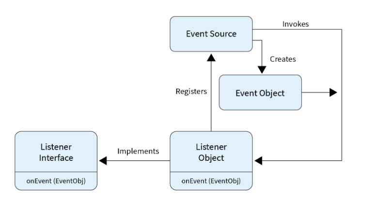
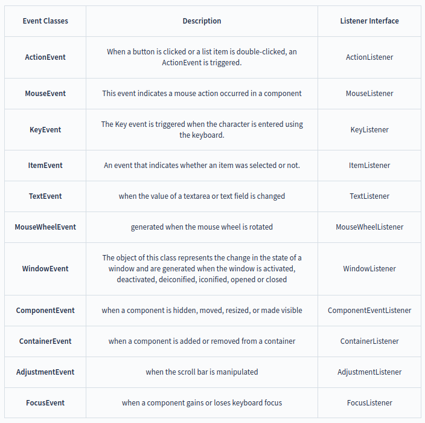

# Lab-4 : Event handling in Javascript  
-     Write a program to demonstrate page load event.  
-     Write JS code to illustrate element positioning, stacking elements and mouse cursor.  
-     Write JS function to validate a form input field for onblur event whether it is blank or not and contains number or not.  
-     Write JS code to find the factorial of a number requesting a number from user using prompt. Display result on button click.  
-     Create an HTML form that takes user's email address and password. Validate the form using JS when the submit button is clicked. Make sure that the fields   are not empty and the email address is a valid email address.  
-     Write a JS program which validates the user data (name, email, contact no, country) and displays the success message if validated successfully. Also create the HTML form for entering the data.    

# Objective  
    To implement event handling function in Javascript  

# Theory  
    Many event listeners are frequently used; recall the click of a button that takes you to another website or the mouse scroll? All of this is accomplished through the use of various event handlers, and the mechanism is known as event handling.  
  
    Events in Java:-  
    Events in Java represent the change in the state of any object. Events occur when the user interacts with the interface. Clicking a button, moving the   mouse, typing a character, selecting an item from a list, and scrolling the page are all examples of behaviours that cause an event to occur.  
   
-      Events are divided into two major categories:-  
1)     Foreground Events: These events necessitate the user's direct participation. They are produced as a result of a user interacting with graphical components in a Graphical User Interface. 
2)     Background Events: Background events are those that require end-user interaction. Operating system interrupts and hardware or software failure are examples of background events. 

-     Event handling in Java is the process of controlling an event and taking appropriate action if one occurs.   

-     How are Events Handled?  
      The modern approach to event processing is based on the Delegation Model. It defines a standardized and compatible mechanism for generating and processing  events. In this approach, a source generates an event and sends it to one or more listeners. The listener sits and waits for an event to   occur. When it gets an event, it is processed by the listener and returned. The user interface elements can delegate the processing of an event to a   different function.  

-     The image below shows the flow chart of the event delegation model.         
  

    Important Event Classes and Interface in Java:-  
  

# CONCLUSION  
    We learnt the implementation event handling function in JS.
    

